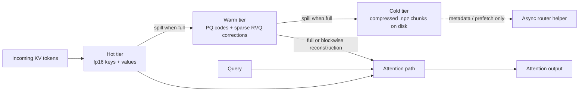

# RFSN v10.2

Experimental Apple Silicon oriented KV-cache research prototype built around MLX, product quantization, residual vector quantization, and a tiered hot/warm/cold cache model.

This repository is focused on correctness, explicit behavior, and honest benchmarking of the current implementation. It is not a full serving stack and it does not claim verified Apple Neural Engine execution.

## At a glance

| Area | Status |
| --- | --- |
| MLX prototype | Implemented |
| Product quantization (PQ) | Implemented |
| Residual vector quantization (RVQ) corrections | Implemented |
| Hot tier | Implemented |
| Warm tier | Implemented |
| Cold spill to disk | Implemented |
| Cold-tier read attention | Not implemented |
| Blockwise warm reconstruction | Implemented |
| Partial warm routing (`all`, `recent`) | Implemented |
| GQA-aware benchmark reporting | Implemented |
| Resumable long-sweep benchmarking | Implemented |
| Verified ANE execution | Not implemented |
| Production serving/runtime integration | Not implemented |

> Important
>
> The benchmark harness in this repository is a synthetic sequence-level KV-cache benchmark. It does not run end-to-end Llama inference. The README is explicit about that because the code is explicit about that.

## What this repo is

- A correctness-first MLX prototype for tiered KV caching on Apple Silicon.
- A place to compare dense reference attention against the current hot+warm cache path.
- A testbed for evaluating full warm reconstruction versus blockwise warm reconstruction.
- A benchmark harness for Llama 3.2-shaped synthetic KV workloads, including grouped-query-attention-aware storage reporting.

## What this repo is not

- Not a production inference engine.
- Not a full transformer implementation.
- Not proof of ANE execution.
- Not a cold-tier read-path implementation.
- Not a latency claim for real Llama serving.

## Repository layout

| File | Purpose |
| --- | --- |
| `rfsn_v10_mlx_ane_complete.py` | Core MLX prototype: quantizers, tiered cache, attention path, router helper, calibration, and correctness tests |
| `rfsn_v10_eval_benchmark.py` | Synthetic benchmark harness for dense vs cache-path comparisons |
| `rfsn_v10_llama32_benchmark.py` | Convenience wrapper for Llama 3.2-shaped benchmark presets |
| `rfsn_v10_unified_mac_launcher.py` | Backend detector and smoke launcher for MLX or PyTorch fallback |

## Architecture overview



### Core design choices

- The hot tier stores fp16 keys and values directly in memory.
- The warm tier stores keys and values separately as PQ codes plus optional sparse RVQ corrections.
- The cold tier writes compressed `.npz` chunks to disk.
- The current attention path reads hot tokens and reconstructed warm tokens only.
- The current implementation does not read cold chunks back into attention during inference.
- The benchmark harness compares cache output against a dense reference over the full visible prefix, so missing cold reads show up as honest error rather than being hidden.

## Dependencies and environment

### Recommended environment

- macOS on Apple Silicon
- Python 3.9 or newer
- MLX installed for the core prototype and benchmark harness

### Required Python packages

- `numpy`
- `mlx`

### Optional Python packages

- `torch`
  Used only by the unified launcher for MPS or CPU fallback smoke testing.

### Notes

- There is no `requirements.txt` in the repository at the moment.
- The scripts default the following thread-related environment variables to `4` when unset:
  - `OMP_NUM_THREADS`
  - `MKL_NUM_THREADS`
  - `VECLIB_MAXIMUM_THREADS`

## Setup

```bash
python3 -m venv .venv
source .venv/bin/activate
python3 -m pip install --upgrade pip
python3 -m pip install numpy mlx
python3 -m pip install torch  # optional, only for launcher fallback
```

## Quick start

### 1. Run the unified launcher

```bash
python3 rfsn_v10_unified_mac_launcher.py
```

What it does:

- Detects backend availability in this order: MLX, PyTorch MPS, PyTorch CPU
- Runs the MLX prototype tests if MLX is available
- Otherwise runs a small PyTorch attention smoke test
- Reports backend availability only; it does not prove ANE execution

### 2. Run the MLX prototype tests directly

```bash
python3 rfsn_v10_mlx_ane_complete.py
```

Expected outcome:

- 15 correctness and accounting checks
- Final log line: `All tests passed`

### 3. Run a benchmark smoke test

```bash
python3 rfsn_v10_eval_benchmark.py \
  --sequence-lengths 256 \
  --step-tokens 128 \
  --hot-capacity 64 \
  --warm-capacity 256 \
  --modes pq hybrid \
  --output /tmp/rfsn_v10_benchmark_smoke.csv
```

### 4. Run the Llama 3.2-shaped long sweeps

```bash
python3 rfsn_v10_llama32_benchmark.py llama32-1b --long-sweep
python3 rfsn_v10_llama32_benchmark.py llama32-3b --long-sweep
```

By default, the wrapper resumes from an existing CSV if one exists.

## Core prototype details

### `RFSNConfig`

The central configuration object controls:

- model shape: `hidden_dim`, `num_heads`, `head_dim`, `num_layers`
- PQ shape: `num_subspaces`, `pq_bits`, `subspace_dim`
- RVQ shape: `num_rvq_layers`, `rvq_codebook_size`, `rvq_sparsity_threshold`
- cache capacities: `hot_capacity`, `warm_capacity`, `cold_capacity`
- blockwise decode granularity: `block_size_seq`
- disk spill behavior: `disk_cache_dir`, `max_open_files`, `prefetch_throttle_s`
- CPU-side behavior: `cpu_threads`

Validation guarantees:

- `head_dim == num_subspaces * subspace_dim`

### Quantization pipeline

The implementation uses two stages:

1. Product Quantization
   - splits a vector into equal subspaces
   - encodes each subspace against a learned codebook
   - reconstructs a PQ approximation

2. Residual Vector Quantization
   - encodes residuals left after PQ reconstruction
   - stores sparse correction rows and row offsets
   - applies corrections on decode

`HybridQuantizerMLX` composes the two stages and returns:

- PQ codes
- RVQ codes
- RVQ mask
- RVQ offsets

### Tiered cache behavior

#### Hot tier

- Stores fp16 keys and values directly.
- Grows until `hot_capacity` is reached.

#### Warm tier

- Stores keys and values separately.
- Uses PQ codes for dense storage.
- Uses RVQ rows plus offsets for sparse corrections.
- Can reconstruct either the entire warm tier or selected token blocks.

#### Cold tier

- Stores overflow on disk as compressed `.npz` chunks.
- Writes metadata and compressed code arrays.
- Can be loaded via `load_cold_chunk()`.
- Is not read by `attention_forward()` today.

### Attention behavior

The cache supports two warm read modes:

- `full`
  - reconstruct the entire warm tier first
  - concatenate hot + warm
  - run dense reference attention over the concatenated visible cache

- `blockwise`
  - keep hot tokens resident
  - reconstruct only one warm block at a time
  - stream attention over hot plus reconstructed warm blocks
  - lower transient warm reconstruction memory

Blockwise warm routing policies:

- `all`
  - process every warm block

- `recent`
  - process only the last `N` warm blocks
  - `N` is controlled by `--warm-selection-blocks`

Selection semantics are exact:

- warm blocks are built as contiguous token ranges of size `--warm-block-size`
- `recent` selects the last `min(selection_blocks, total_blocks)` ranges
- selected ranges must be sorted and non-overlapping

### Profiling and memory accounting

`attention_forward_profile()` returns both the output and a metrics dictionary with:

- timing metrics
- warm reconstruction metrics
- visible KV footprint
- stored compressed bytes
- transient dense fp32 working-set estimates

This is the metrics surface consumed by the benchmark harness.

### Async router helper

`AsyncHierarchicalRouterMLX` is a simple chunk-prefetch helper:

- uses window-based candidate chunk selection
- asynchronously preloads disk chunks into an in-memory cache
- does not claim predictive quality beyond that heuristic

## Benchmark harness semantics

The benchmark harness is intentionally strict and honest.

### What it measures

- dense reference attention over the full prefix
- cache update time as tokens are added
- cache-path attention using the current implementation
- output drift between dense reference and cache output
- optional score drift on the visible keys actually used by the cache path
- memory footprint of stored and reconstructed KV data

### What it does not do

- it does not benchmark full model generation
- it does not benchmark a cold-tier read path, because that path does not exist
- it does not pretend repeated KV heads are native GQA execution

### GQA behavior

For the Llama-shaped presets, the harness supports separate query and KV head counts.

Current latency path:

- synthetic KV tensors are generated at `num_kv_heads`
- they are repeated to `num_query_heads` for the current attention benchmark path

Current memory reporting:

- measured latency remains tied to the current repeated-head execution path
- `gqa_effective_*` columns scale storage and dense-KV byte counts back to true KV-head counts
- this keeps the latency story and the storage story separate and honest

### Cold spill behavior

By default, the harness rejects sequence lengths larger than `hot_capacity + warm_capacity`.

Reason:

- the cache cannot currently read cold chunks during attention
- benchmarking longer contexts without an explicit opt-in would hide a real limitation

If you pass `--allow-cold-spill`:

- overflow tokens can spill to disk
- dense reference still uses the full prefix
- cache output still only sees hot + warm visible tokens
- resulting drift reflects the missing cold read path honestly

### Resume behavior

The harness supports resumable CSV output with `--resume`.

How it works:

- rows are written incrementally as each benchmark combination finishes
- an existing CSV is loaded and validated against the current schema
- completed rows are identified by run identity fields and skipped on rerun

This is what makes long 8k to 16k sweeps restartable without losing finished work.

## CLI reference

### `rfsn_v10_eval_benchmark.py`

#### Workload and routing options

| Flag | Meaning | Default |
| --- | --- | --- |
| `--preset` | Apply a named model-shape preset | none |
| `--sequence-lengths` | Sequence lengths to benchmark | `2048 4096` |
| `--modes` | Quantization mode(s) to benchmark | `pq hybrid` |
| `--warm-read-modes` | Warm read path(s) | `full` |
| `--warm-selection-policies` | Warm block selection policy | `all` |
| `--trials` | Number of trials per combination | `1` |
| `--seed` | Base RNG seed | `0` |
| `--step-tokens` | Prefix growth per step | `256` |
| `--warm-block-size` | Tokens per block for blockwise reconstruction | `256` |
| `--warm-selection-blocks` | Number of trailing warm blocks used by `recent` | `2` |
| `--query-batch` | Query batch size per step | `1` |

#### Shape options

| Flag | Meaning | Default |
| --- | --- | --- |
| `--num-heads` | Backward-compatible alias for `--num-query-heads` | unset |
| `--num-query-heads` | Query head count | preset-specific, otherwise `4` |
| `--num-kv-heads` | KV head count | preset-specific, otherwise `num_query_heads` |
| `--head-dim` | Per-head dimension | preset-specific, otherwise `128` |

#### Quantization options

| Flag | Meaning | Default |
| --- | --- | --- |
| `--num-subspaces` | PQ subspace count | `8` |
| `--pq-bits` | PQ bit width | `8` |
| `--num-rvq-layers` | RVQ layers for hybrid mode | `4` |
| `--rvq-codebook-size` | RVQ codebook size | `128` |
| `--rvq-sparsity-threshold` | RVQ sparsity threshold | `0.005` |

#### Capacity and behavior options

| Flag | Meaning | Default |
| --- | --- | --- |
| `--hot-capacity` | Visible fp16 hot tokens | `1024` |
| `--warm-capacity` | Visible compressed warm tokens | `8192` |
| `--cold-capacity` | Allowed cold spill tokens | `2000000` |
| `--skip-score-drift` | Skip score-space drift metrics | off |
| `--allow-cold-spill` | Permit lengths beyond hot+warm visible capacity | off |
| `--resume` | Resume from an existing CSV if present | off |
| `--output` | Output CSV path | `rfsn_v10_benchmark_results.csv` or preset-specific |

#### Presets

| Preset | Query heads | KV heads | Head dim | KV group size |
| --- | --- | --- | --- | --- |
| `llama32-1b` | `32` | `8` | `64` | `4` |
| `llama32-3b` | `24` | `8` | `128` | `3` |

### `rfsn_v10_llama32_benchmark.py`

| Flag | Meaning | Default |
| --- | --- | --- |
| positional `preset` | `llama32-1b`, `llama32-3b`, or `all` | required |
| `--long-sweep` | Use `2048 4096 8192 12288 16384` | off |
| `--include-full` | Include `full` warm reconstruction in addition to `blockwise` | off |
| `--no-resume` | Disable automatic resume behavior | off |
| `--output-dir` | Directory for generated CSVs | `/tmp` |
| `--sequence-lengths` | Manual override for lengths | unset |
| `--modes` | Modes to run | `pq hybrid` |
| `--trials` | Trial count | `1` |
| `--seed` | RNG seed | `0` |
| `--step-tokens` | Prefix step size | `512` |
| `--warm-block-size` | Warm block size | `512` |
| `--warm-selection-blocks` | Recent routing depth | `2` |
| `--hot-capacity` | Hot visible capacity | `1024` |
| `--warm-capacity` | Warm visible capacity | `16384` |
| `--cold-capacity` | Cold spill capacity | `2000000` |
| `--allow-cold-spill` | Allow spill beyond visible capacity | off |

Wrapper output naming:

- default sweep: `/tmp/rfsn_v10_<preset>_default.csv`
- long sweep: `/tmp/rfsn_v10_<preset>_long.csv`

## Common commands

### Run the core regression suite

```bash
python3 rfsn_v10_mlx_ane_complete.py
```

### Run the unified launcher

```bash
python3 rfsn_v10_unified_mac_launcher.py
```

### Benchmark dense vs cache path on a small smoke workload

```bash
python3 rfsn_v10_eval_benchmark.py \
  --sequence-lengths 256 \
  --step-tokens 128 \
  --hot-capacity 64 \
  --warm-capacity 256 \
  --modes pq hybrid \
  --output /tmp/rfsn_v10_benchmark_smoke.csv
```

### Compare full vs blockwise warm reads

```bash
python3 rfsn_v10_eval_benchmark.py \
  --sequence-lengths 2048 4096 8192 \
  --step-tokens 512 \
  --hot-capacity 512 \
  --warm-capacity 8192 \
  --modes pq hybrid \
  --warm-read-modes full blockwise \
  --warm-block-size 512 \
  --trials 1 \
  --output /tmp/rfsn_v10_blockwise_compare.csv
```

### Compare blockwise `all` vs blockwise `recent`

```bash
python3 rfsn_v10_eval_benchmark.py \
  --sequence-lengths 2048 4096 8192 \
  --step-tokens 512 \
  --hot-capacity 512 \
  --warm-capacity 8192 \
  --modes pq hybrid \
  --warm-read-modes blockwise \
  --warm-block-size 512 \
  --warm-selection-policies all recent \
  --warm-selection-blocks 2 \
  --trials 1 \
  --output /tmp/rfsn_v10_partial_compare.csv
```

### Run completed Llama-shaped long sweeps

```bash
python3 rfsn_v10_llama32_benchmark.py llama32-1b --long-sweep
python3 rfsn_v10_llama32_benchmark.py llama32-3b --long-sweep
```

### Run both presets

```bash
python3 rfsn_v10_llama32_benchmark.py all --long-sweep
```

## Benchmark output schema

The benchmark CSV is intentionally detailed. The full field list is defined in `CSV_FIELDS` inside `rfsn_v10_eval_benchmark.py`.

### Run identity and workload

- `mode`
- `warm_read_mode`
- `warm_block_size_tokens`
- `warm_selection_policy`
- `warm_selection_blocks`
- `trial_index`
- `seed`
- `seq_len`
- `step_tokens`
- `num_steps`
- `query_batch`

### Shape and quantization

- `num_query_heads`
- `num_kv_heads`
- `kv_group_size`
- `num_heads`
- `head_dim`
- `num_subspaces`
- `pq_bits`
- `num_rvq_layers`

### Cache and routing state

- `hot_capacity`
- `warm_capacity`
- `cold_capacity`
- `warm_active_steps`
- `warm_active_ratio`
- `cold_spill_active`
- `avg_warm_blocks`
- `peak_warm_blocks`
- `avg_warm_decode_tokens`
- `avg_warm_coverage_ratio`
- `avg_warm_tokens_per_processed_block`

### Timing

- `avg_update_ms`
- `avg_dense_ms`
- `avg_cache_total_ms`
- `avg_cache_concat_ms`
- `avg_cache_attention_ms`
- `avg_warm_reconstruct_ms`

### Output and score drift

- `mean_output_mse`
- `mean_output_l2`
- `max_output_linf`
- `mean_score_mse`
- `mean_score_l2`
- `max_score_linf`

### Final visible state

- `final_visible_tokens`
- `final_hot_tokens`
- `final_warm_tokens`
- `final_cold_tokens`

### Storage and working-set accounting

- `final_hot_bytes`
- `final_warm_key_pq_bytes`
- `final_warm_value_pq_bytes`
- `final_warm_key_rvq_bytes`
- `final_warm_value_rvq_bytes`
- `final_stored_bytes`
- `peak_stored_bytes`
- `peak_warm_reconstruction_fp16_bytes`
- `peak_warm_reconstruction_fp32_bytes`
- `peak_dense_kv_fp32_bytes`
- `dense_visible_kv_bytes`
- `dense_full_kv_bytes`
- `visible_savings_bytes`

### GQA-effective storage accounting

- `gqa_effective_peak_stored_bytes`
- `gqa_effective_peak_warm_reconstruction_fp16_bytes`
- `gqa_effective_peak_warm_reconstruction_fp32_bytes`
- `gqa_effective_peak_dense_kv_fp32_bytes`
- `gqa_effective_dense_visible_kv_bytes`
- `gqa_effective_dense_full_kv_bytes`
- `gqa_effective_final_stored_bytes`
- `gqa_effective_visible_savings_bytes`

## Benchmark snapshot: completed Llama 3.2-shaped long sweeps

The following results were produced with:

- `--long-sweep`
- `--trials 1`
- `--seed 0`
- `--step-tokens 512`
- `--warm-block-size 512`
- `--warm-selection-blocks 2`
- `--hot-capacity 1024`
- `--warm-capacity 16384`
- `--cold-capacity 2000000`
- `--modes pq hybrid`
- `--warm-read-modes blockwise`
- `--warm-selection-policies all recent`

### Key pattern

With `recent` routing and a fixed 2-block selection depth, warm coverage falls as context grows:

- `8192`: about `0.39`
- `12288`: about `0.29`
- `16384`: about `0.23`

That reduces cache time and warm reconstruction time materially, but it increases output drift.

### 16k summary

| Preset | Mode | `all` cache ms | `recent` cache ms | Reduction | `all` MSE | `recent` MSE | GQA effective stored MB | GQA visible savings MB |
| --- | --- | ---: | ---: | ---: | ---: | ---: | ---: | ---: |
| llama32-1b | pq | 104.986 | 51.887 | 50.6% | 4.327985e-04 | 8.574966e-04 | 3.88 | 28.12 |
| llama32-1b | hybrid | 234.488 | 73.214 | 68.8% | 5.772299e-04 | 8.532496e-04 | 5.75 | 26.25 |
| llama32-3b | pq | 96.700 | 28.920 | 70.1% | 4.295740e-04 | 8.740215e-04 | 5.88 | 58.12 |
| llama32-3b | hybrid | 327.174 | 116.361 | 64.4% | 6.524312e-04 | 9.039084e-04 | 7.75 | 56.25 |

### Selected 8k to 16k rows

#### llama32-1b

| Seq | Mode | Policy | Cache ms | Warm ms | Coverage | Output MSE |
| --- | --- | --- | ---: | ---: | ---: | ---: |
| 8192 | pq | all | 64.562 | 36.888 | 1.00 | 5.044766e-04 |
| 8192 | pq | recent | 40.068 | 13.461 | 0.39 | 6.618200e-04 |
| 8192 | hybrid | all | 115.010 | 88.375 | 1.00 | 5.983512e-04 |
| 8192 | hybrid | recent | 51.171 | 29.899 | 0.39 | 7.302645e-04 |
| 12288 | pq | all | 82.856 | 50.372 | 1.00 | 4.536480e-04 |
| 12288 | pq | recent | 24.459 | 9.105 | 0.29 | 7.984560e-04 |
| 12288 | hybrid | all | 371.044 | 204.552 | 1.00 | 6.158200e-04 |
| 12288 | hybrid | recent | 107.698 | 33.461 | 0.29 | 8.239922e-04 |
| 16384 | pq | all | 104.986 | 70.993 | 1.00 | 4.327985e-04 |
| 16384 | pq | recent | 51.887 | 10.949 | 0.23 | 8.574966e-04 |
| 16384 | hybrid | all | 234.488 | 190.164 | 1.00 | 5.772299e-04 |
| 16384 | hybrid | recent | 73.214 | 32.294 | 0.23 | 8.532496e-04 |

#### llama32-3b

| Seq | Mode | Policy | Cache ms | Warm ms | Coverage | Output MSE |
| --- | --- | --- | ---: | ---: | ---: | ---: |
| 8192 | pq | all | 50.900 | 29.523 | 1.00 | 5.211108e-04 |
| 8192 | pq | recent | 30.964 | 10.315 | 0.39 | 7.455393e-04 |
| 8192 | hybrid | all | 124.383 | 94.852 | 1.00 | 6.471479e-04 |
| 8192 | hybrid | recent | 71.002 | 29.087 | 0.39 | 7.868221e-04 |
| 12288 | pq | all | 75.654 | 47.232 | 1.00 | 5.337127e-04 |
| 12288 | pq | recent | 27.956 | 10.720 | 0.29 | 8.439263e-04 |
| 12288 | hybrid | all | 212.501 | 167.090 | 1.00 | 7.067702e-04 |
| 12288 | hybrid | recent | 64.797 | 32.827 | 0.29 | 8.558448e-04 |
| 16384 | pq | all | 96.700 | 66.723 | 1.00 | 4.295740e-04 |
| 16384 | pq | recent | 28.920 | 9.756 | 0.23 | 8.740215e-04 |
| 16384 | hybrid | all | 327.174 | 230.810 | 1.00 | 6.524312e-04 |
| 16384 | hybrid | recent | 116.361 | 49.491 | 0.23 | 9.039084e-04 |

## Test coverage

The built-in test suite currently checks:

1. PQ encode/decode shape and finite distortion
2. RVQ offsets map to valid row indices
3. Hybrid reconstruction improves or matches PQ-only distortion
4. Calibration lowers or preserves PQ distortion
5. Warm tier stores keys and values separately
6. Warm reconstruction returns coherent key/value tensors
7. Hot-only attention matches dense reference
8. Warm-only reconstructed attention matches dense reference built from reconstructed K/V
9. Hot+warm combined attention matches dense reference over hot plus reconstructed warm K/V
10. Profiled attention matches unprofiled cache output and emits finite metrics
11. Blockwise warm attention matches full warm attention while lowering transient warm bytes
12. Partial warm block selection matches dense reference over hot plus selected warm ranges
13. Cold spill writes real `.npz` files with expected fields
14. Router prefetch loads chunk files without crashing
15. Memory usage accounting is finite

## Known limitations

- Cold read-path attention is not implemented.
- Quantized codebook fast paths are not implemented.
- There is no production serving integration.
- There is no tokenizer, model loader, or generation loop.
- ANE execution is not verified.
- Benchmark results are synthetic and hardware-dependent.

## Practical next steps

- Implement cold-tier read attention so `--allow-cold-spill` can become a complete visible-context path.
- Add real model integration around the cache instead of synthetic random KV tensors.
- Separate measured repeated-head latency from a true native-GQA execution path.
- Add packaged dependency metadata (`requirements.txt`, `pyproject.toml`, or both).
- Persist benchmark artifacts inside the repository or a reproducible results directory instead of `/tmp`.

## License

No license file is present in this repository right now.